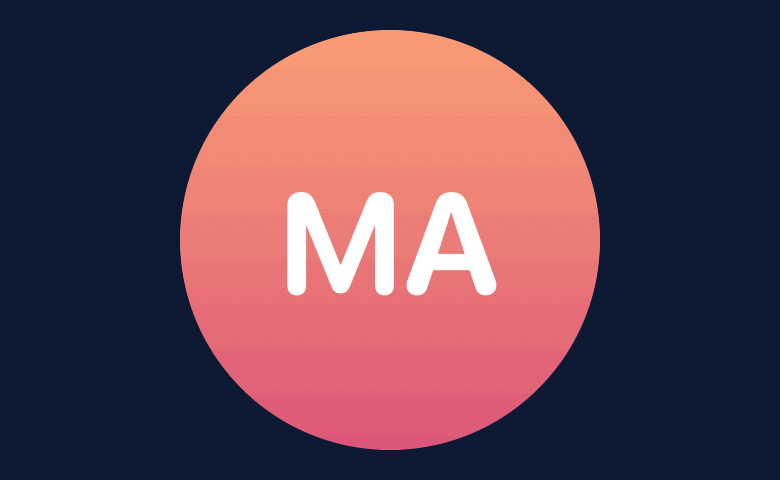
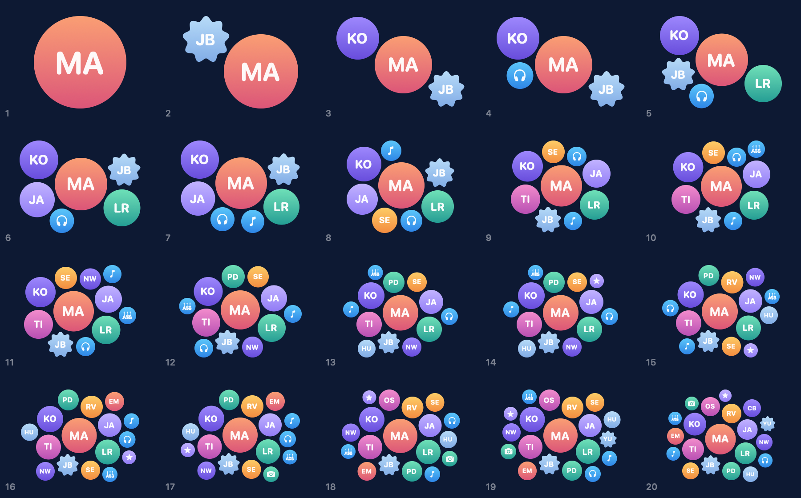

# Posy

A SwiftUI `Layout` that packs views of different importance into one compact, organic cluster — the kind of avatar bunch you see on a group chat's header.

<p align="center">
  
</p>

Give each view an importance. Posy decides how big it is and where it goes: the important ones sit in the middle, the rest settle into the gaps around them.

## Quick start

Add the package in Xcode (**File → Add Package Dependencies…**) or in `Package.swift`:

```swift
.package(url: "https://github.com/Eirperuier/Posy.git", from: "0.1.0")
```

Then:

```swift
import Posy

PosyLayout(spacing: 6) {
    ForEach(members) { member in
        Avatar(member)
            .clipShape(Circle())
            .posyImportance(member.isHost ? 1 : 0.4)
    }
}
.frame(height: 240)
.animation(.spring, value: members)
```

Each subview is proposed a square, so avatars should be resizable (`Image(...).resizable().scaledToFill()`, a filled `Circle` with an overlay, and so on).

Requires iOS 16, macOS 13, tvOS 16, watchOS 9 or visionOS 1.

## What you get

**Size from importance.** Area is proportional to importance: `1` is full size, `0.25` is half the diameter. Views without `.posyImportance` count as `1`.

**Two sizing modes.**

```swift
PosyLayout(sizing: .fit)                              // fill the proposed frame (default)
PosyLayout(sizing: .natural(unitDiameter: 48))        // fixed scale, report the size needed
```

In `.fit` mode the cluster grows toward the frame's aspect ratio, so a wide header gets a wide cluster. Spacing stays in points.

**Stable when people join.** Appending a view that is no more important than any view already there does not move the others relative to each other. SwiftUI animates the change as the cluster making room, not as a reshuffle. This is covered by tests.

**Deterministic.** The same input always produces the same layout. No random seeds, no physics simulation that settles differently each run.

<p align="center">
  
</p>

## How it works

Views are placed largest first. Each one goes into a free spot where it touches two neighbors (a pocket) or, early on, one neighbor. Among those spots Posy picks the one that stays closest to the cluster's middle while keeping the most important view centered in the bounding box, so satellites spread around the host instead of piling up on one side. A frame's aspect ratio stretches the distance metric into an ellipse.

The algorithm lives in `PosyCore`, which has no SwiftUI dependency. Use it directly for Canvas, UIKit, AppKit or server-side rendering:

```swift
import PosyCore

let packing = ClusterPacker(spacing: 4).pack(
    [ClusterItem(importance: 1), ClusterItem(importance: 0.4), ClusterItem(importance: 0.3)],
    fitting: CGSize(width: 320, height: 200)
)
for placement in packing.placements {
    // placement.center, placement.diameter
}
```

Collision geometry is defined by the `ClusterShape` protocol as a set of disks, not a hard-coded circle. v0.1 ships `.circle`; a shape made of several disks (a pill, a badge) already packs correctly through `PosyCore`.

## Compared to

| | Posy | [d3-hierarchy](https://d3js.org/d3-hierarchy/pack) `pack` / `packSiblings` | [Magnetic](https://github.com/efremidze/Magnetic) | Manual `ZStack` offsets |
|---|---|---|---|---|
| Platform | SwiftUI (+ plain Swift core) | JavaScript | UIKit + SpriteKit | SwiftUI |
| Input | Importance per view | Radius per circle | Nodes in a physics scene | Hand-picked positions |
| Picks sizes for you | Yes | No (`pack` scales a hierarchy by value) | No | No |
| Fits a given frame | Yes, and follows its aspect ratio | `pack` fits one enclosing circle | No, nodes float in the scene | Per design |
| Deterministic | Yes | Yes | No, physics settles differently | Yes |
| Stable when appending | Yes, for items no larger than the rest | Yes, in input order | Physics re-settles the scene | Only for the counts you designed |
| Non-circular shapes | Disk-based `ClusterShape` protocol | Circles only | Circles | Anything |
| Animates with SwiftUI | Yes, it is a `Layout` | — | SpriteKit actions | Yes |

## Performance

Packing is greedy with an exhaustive pocket search, roughly O(n⁴) in the worst case. In release builds on an M-series Mac, fitting 50 items takes about 2 ms and 100 items about 20 ms. `PosyLayout` caches results per proposal, so a layout pass does not repack unless the inputs change. It is built for avatar-sized groups, not for thousands of bubbles.

## Gallery app

The repository includes a macOS app for judging layouts by eye and by number: every count from 1 to 20, several importance distributions, both sizing modes, and per-cell metrics (coverage, balance, how strictly larger items sit inside). A playground tab lets you add, remove and promote members to see how changes animate.

```sh
swift run PosyGallery
```

`swift run ReadmeAssets` regenerates the images in this README from real packings.

## Roadmap

- Expose custom shapes through the SwiftUI API (`.posyShape(_:)`) and ship rounded squares and scalloped badges.
- Hand-tuned arrangements for one to four items, where a template can beat any packing.
- Better stability when an item is removed from the middle or promoted.

## License

MIT
